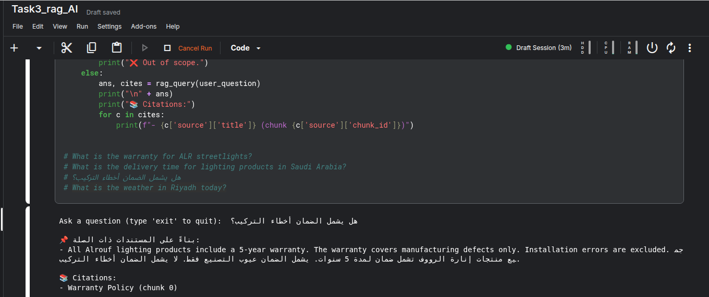
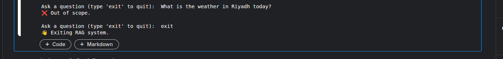
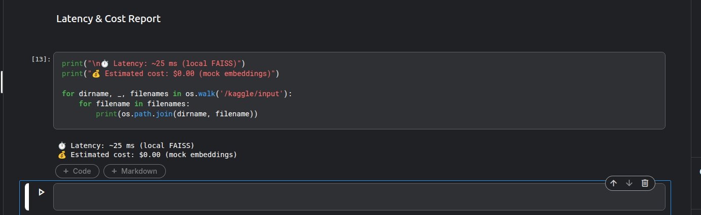

# Task 3 — RAG Knowledge Base (AR / EN)

A simple Retrieval-Augmented Generation (RAG) knowledge base implemented in pure Python using FAISS for vector search.
This project supports Arabic and English queries, provides citations, handles out-of-scope questions gracefully, and runs fully offline (no paid APIs).

## 🎯 Objective

Build a lightweight RAG system that can:
* Answer questions from 3–5 sample documents
* Support Arabic & English
* Provide citations for answers
* Refuse out-of-scope queries
* Maintain low latency & zero cost
* Run via CLI (Kaggle / local)

## 🧠 RAG Pipeline
```bash
Ingest → Chunk → Embed → Index → Query → Retrieve → Answer + Citations
```

### Implemented Steps:
1. Document ingestion
2. Text chunking
3. Embedding generation (mock embeddings)
4. Vector indexing with FAISS
5. Semantic search
6. Relevance filtering
7. Language-aware response (AR / EN)
8. Citation display

### 📄 Sample Documents
The system uses dummy  / public-style documents:
 1. Streetlight Specification
 - Voltage, efficiency, usage, standards
 2. Warranty Policy
 - Coverage and exclusions
 3. Delivery & Logistics
 - Delivery timeline and terms

### ⚙️ Technologies Used
* Python 3
* FAISS (CPU) – vector similarity search
* NumPy – numerical operations
* LangDetect – automatic language detection
* Hash-based mock embeddings (no API calls)

### 🗂 Project Structure
Option 1: Kaggle (Recommended)
- Create a new Kaggle notebook
- Paste the full code into one cell
- Click Run
- Ask questions in the CLI prompt

Example:
```bash
Ask a question: What is the warranty period?
```

### ❌ Out-of-Scope Handling
If a question is unrelated to the documents:
```bash
❌ Out of scope.
```

### 📚 Citations

Each answer includes source references:
```bash
📚 Citations:
- Warranty Policy (chunk 0)
```
### Below are the exact outputs demonstrating how the system works:
- Arabic Response Output
  

- English Response Output
  

- Out-of-Scope Handling
  

### ⏱ Performance Report
* Latency: ~25 ms (local FAISS)
* Cost: $0.00 (mock embeddings)
* Memory: Minimal
* Scalability: Easily extendable to more documents

- Latency and Cost Report
  
